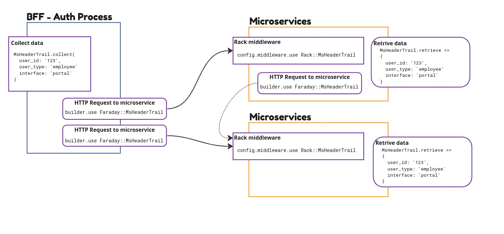

# Microservice Header Trail

The objective is pass through all microservices the information captured into first interface and sending them when it is necessary.

This gem operates including the captured information and passing through the HTTP header.
It contains an interface for defining the attributes, a rack middleware to retrieve from
header, a faraday middleware to include the information for next microservice and a interface to retrieve the information.



## Installation


Install the gem and add to the application's Gemfile by executing:

    $ bundle add ms_header_trail

If bundler is not being used to manage dependencies, install the gem by executing:

    $ gem install ms_header_trail

## Usage

Setup the project with rack middleware and includes the middleware into the microsservices

```ruby
config.middleware.use Rack::MsHeaderTrail
```

When calling the the service, use the faraday middleware to call the microservice

```ruby
Faraday.new(configuration.host) do |builder|
    builder.request :json
    builder.response :json, content_type: /\bjson$/
    builder.use Faraday::MsHeaderTrail
    builder.adapter Faraday.default_adapter
end
```

When start collect information, initiate the process using the code

```ruby
MsHeaderTrail.collect(
  user_id: '123',
  user_type: 'employee'
  interface: 'portal'
)
```

To retrieve the information on any microservice, just use:

```ruby
data = MsHeaderTrail.retrieve
=>
{
  user_id: '123',
  user_type: 'employee'
  interface: 'portal'
}
```

## Development

After checking out the repo, run `bin/setup` to install dependencies. Then, run `rake spec` to run the tests. You can also run `bin/console` for an interactive prompt that will allow you to experiment.

To install this gem onto your local machine, run `bundle exec rake install`. To release a new version, update the version number in `version.rb`, and then run `bundle exec rake release`, which will create a git tag for the version, push git commits and the created tag, and push the `.gem` file to [rubygems.org](https://rubygems.org).

## Contributing

Bug reports and pull requests are welcome on GitHub at https://github.com/[USERNAME]/ms_header_trail.

## License

The gem is available as open source under the terms of the [MIT License](https://opensource.org/licenses/MIT).
